# Affordance Diffusion: Synthesizing Hand-Object Interactions
Yufei Ye, Xueting Li, Abhinav Gupta, Shalini De Mello, Stan Birchfield, Jiaming Song, Shubham Tulsiani, Sifei Liu

Coming soon: [[Project Page]]() [[Video]]() [[Arxiv]]() [[Data Generation]]()


## Installation
See [install.md](docs/install.md)

## Inference
### HOI synthesis

```
python inference.py data.data_dir='docs/demo/*.*g' test_num=3
```

Inference script first synthesizes `$test_num` HOI images in batch and then extract 3D hand pose.


Input| Synthesized HOI images | Extracted 3D Hand Pose
---|---|---
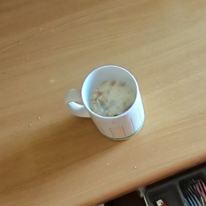 | 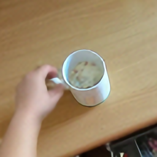  |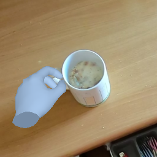 
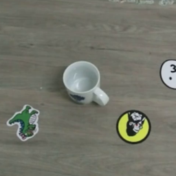 | 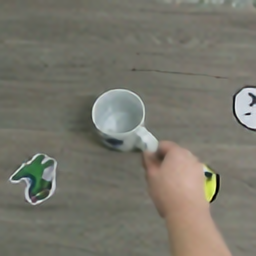  |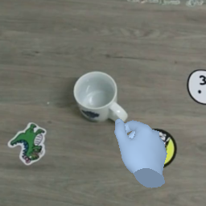 

### Interpolation 
The script takes in the layout parameter of the `$index`-th example predicted from `inference.py`, and smoothly interpolates the HOI synthesis to the horizontally flipped parameters. To run demo, 

```
python -m scripts.interpolate dir=docs/demo_inter
```

This should gives results similar to: 

|Input| Interpolated Layouts | Output  
|---|---|---
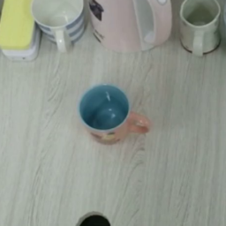 |  | 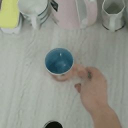 


<details>
<summary>Addtional parameters</summary>
```
python -m scripts.interpolate dir=\${output}/release/layout/cascade index=0000_00_s0
```

- `interpolation.len`:  length of a interpolation sequence
- `interpolation.num`:  number of interpolation sequences
- `interpolation.test_name`:  subfolder to save the output
- `interpolation.orient`: whether to horizontally flip approaching direction
</details>

### Heatmap Guidance
The following command runs guided generation with keypoints in `docs/demo_kpts`
```
python inference  mode=hijack data.data_dir='docs/demo_kpts/*.png' test_name=hijack
```

This should gives results similar to: 

|Input 1| Output 1 | Input 2 | Output 2 
|---|---|---|---
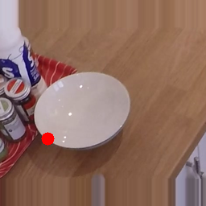 | 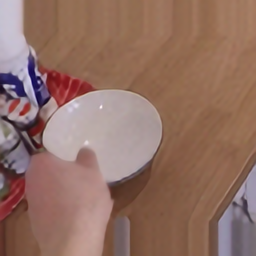 | 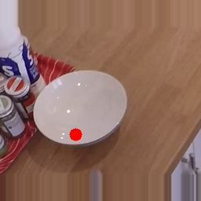 | 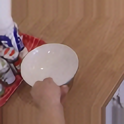 


## Training
### Data Preprocessing (to come)


### Train your own models
- **LayoutNet:** First download off-shelf pretrained model from [here](https://openaipublic.blob.core.windows.net/diffusion/dec-2021/base_inpaint.pt) and specifies the saved path in `configs/model/layout.yaml:resume_ckpt`

```
python engine.py -m  --config-name=train \
  expname=reproduce/\${model.module} \
  model=layout 
```

- **ContentNet-GLIDE:** First download off-shelf pretrained model from [here](https://openaipublic.blob.core.windows.net/diffusion/dec-2021/base_inpaint.pt) and specifies the saved path in `configs/model/content_glide.yaml:resume_ckpt`

```
python engine.py -m  --config-name=train \
  expname=reproduce/\${model.module} \
  model=content_glide
```

- **ContentNet-LDM:** 
First download off-shelf pretrained model from [here](https://github.com/CompVis/latent-diffusion#inpainting) and specifies the saved path in `configs/model/content_ldm.yaml:resume_ckpt`

```
python engine.py -m  --config-name=train \
  expname=reproduce/\${model.module} \
  model=content_ldm 
```

## TODO:

[] frankmocap/Ego_Centric_HOI_Detector

[ ] zip data
[ ] zip code base
[ ] remove my wandb api...


## Acknowledgement
Affordance Diffusion leverages many amazing open-sources shared in research community:
- [Frankmocap](https://github.com/facebookresearch/frankmocap/)
- [Detectron2](https://github.com/facebookresearch/detectron2)
- [Latent Diffusion](https://github.com/CompVis/latent-diffusion) (Files under `ldm/` are modified from this repo)
- [GLIDE](https://github.com/openai/glide-text2im) and [its modification](https://git@github.com/crowsonkb/glide-text2im) (Files under `glide_text2im/` are modified from this repo)
