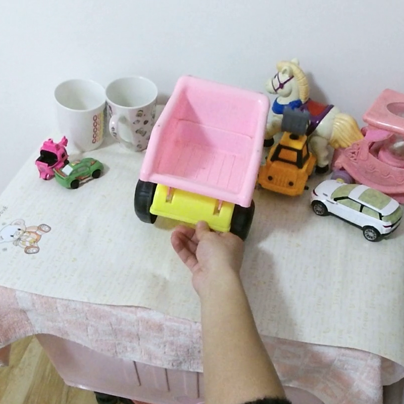
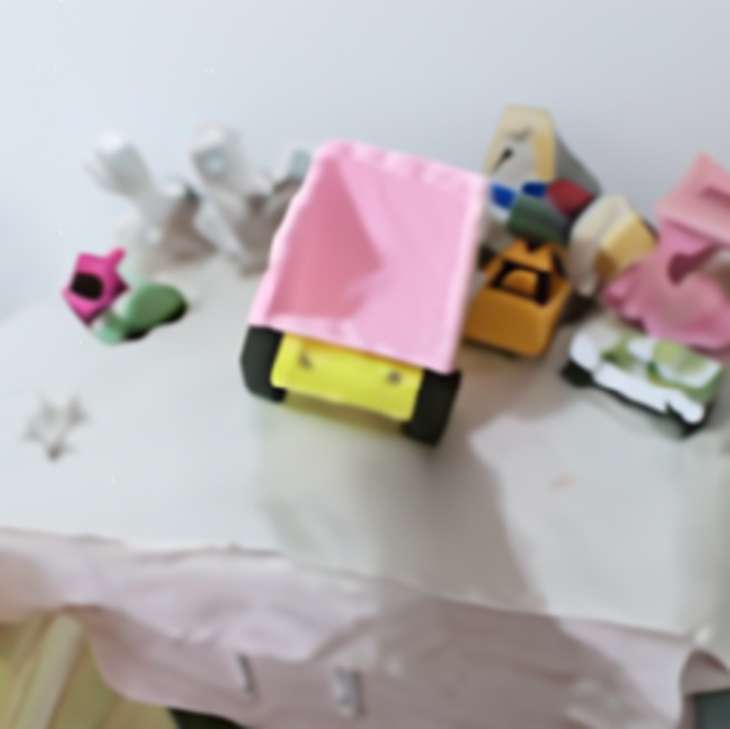

# Affordance Diffusion: Synthesizing Hand-Object Interactions (Data Generation)
Yufei Ye, Xueting Li, Abhinav Gupta, Shalini De Mello, Stan Birchfield, Jiaming Song, Shubham Tulsiani, Sifei Liu

[[Project Page]](https://judyye.github.io/affordiffusion-www/) [[Video]](https://youtu.be/omhEoLzsopo) [[Arxiv]](https://arxiv.org/abs/2303.12538)

This folder contains scripts to generate training data (Hand-Object-interaction and Object-Only Pairs, HO3Pairs) in [Affordance Diffusion](https://judyye.github.io/affordiffusion-www/). The data generation process aims to automatically generate pixel-aligned pairs of hand-object-interaction (HOI) images and object-only images. 
The script takes input as HOI images and removes hands by inpainting techniques to generate object-only images.  This script assumes to work on the [HOI4D]((https://hoi4d.github.io/)) dataset but can be extended to other datasets.


## Individual Installation (for data generation)
```
pip install -r requirement.txt
```
Note: For data generation, please also install `git+https://github.com/openai/glide-text2im`, which is not the same as the modified repo under `glide_text2im/`

## Data Generation
1. Download the original [HOI4D](https://hoi4d.github.io/) dataset (HOI4D_color and HOI4D_annotations) to your data folder `$data_dir`. 
1. Extract frames from videos:
    ```
    python generate_data.py --data_dir $data_dir --save_dir output/ --decode
    ```
1. Inpaint by running the following script
    ```
    python generate_data.py --data_dir $data_dir --save_dir output/ --inpaint
    ```
1. Get hand bboxes
    ```
    python generate_data.py --data_dir $data_dir --save_dir output/ --bbox
    ```

This should generate paired object only counterparts like the following and save the neccessary meta info like hand mask for training. 

HOI Image | Object Image | SDEdited Object Image
---|---|---
 |  | 


## Acknowledgement
Affordance Diffusion (Data Generation) leverages many amazing open-sources shared in research community:
- [GLIDE](https://github.com/openai/glide-text2im)
- [SDEdit](https://github.com/ermongroup/SDEdit)
